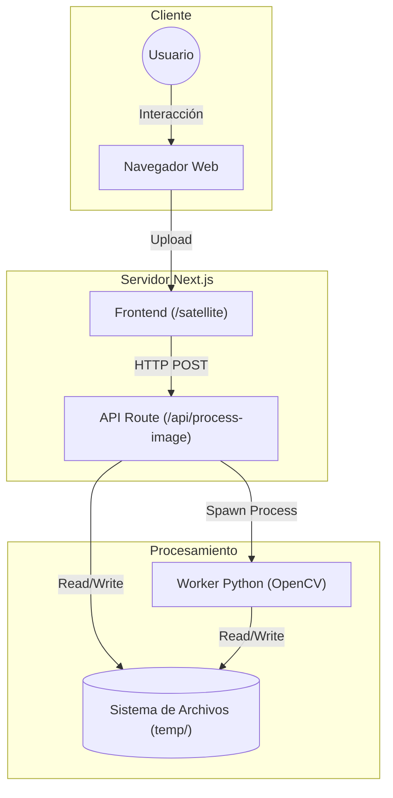
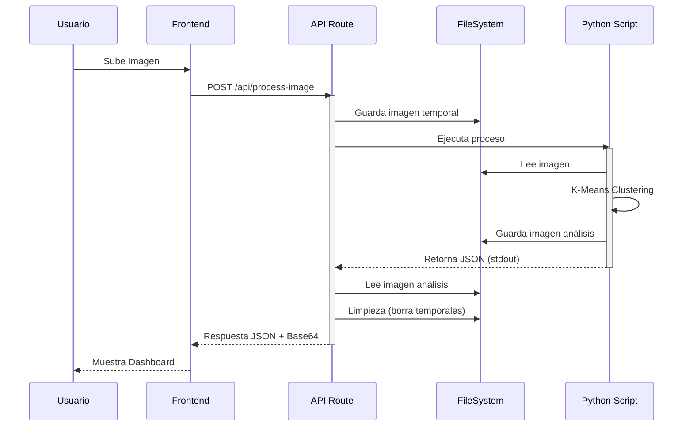

# Arquitectura del Sistema

## Diagrama de Flujo de Datos

### Diagrama de Componentes (Estructura)

### Diagrama de Secuencia (Flujo de Datos)

## Componentes Principales

### 1. Cliente (Browser)
-   Responsable de la interacción con el usuario.
-   Maneja la selección de archivos y parámetros (número de clusters).
-   Visualiza los resultados (imagen original vs. procesada).

### 2. Servidor API (Next.js)
-   Actúa como orquestador.
-   Recibe la petición HTTP.
-   Gestiona el almacenamiento temporal de archivos.
-   Invoca el proceso hijo (Python).
-   Transforma la salida para el cliente.

### 3. Motor de Procesamiento (Python)
-   Ejecuta la lógica pesada de visión por computadora.
-   Utiliza `OpenCV` para el algoritmo K-Means.
-   Utiliza `Matplotlib` para generar visualizaciones estáticas (dashboards).

## ⚠️ Puntos de Dolor Arquitectónicos

1.  **Acoplamiento Fuerte:** La API depende de la estructura exacta de salida (stdout) del script de Python. Cualquier cambio en un `print` puede romper la API.
2.  **Escalabilidad Limitada:**
    -   El procesamiento es síncrono y bloqueante a nivel de CPU.
    -   Cada petición levanta una nueva instancia del intérprete de Python, lo cual es costoso en memoria y tiempo de arranque.
3.  **Estado Efímero:** No hay base de datos. El historial de análisis se pierde al recargar o limpiar la carpeta temporal.
