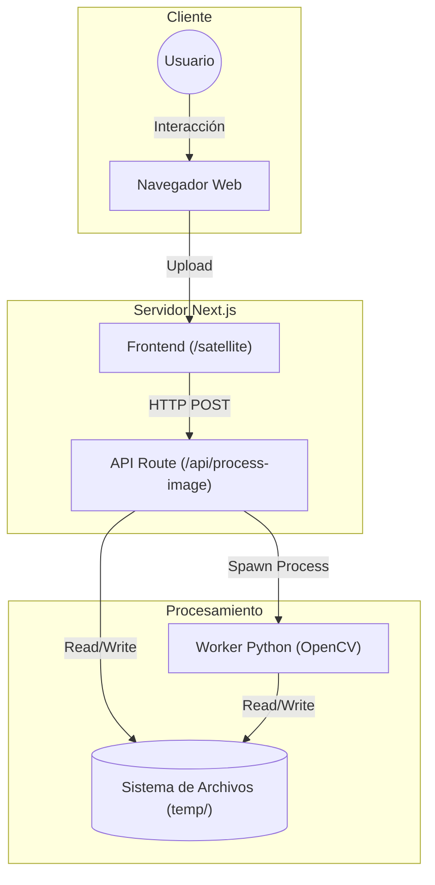
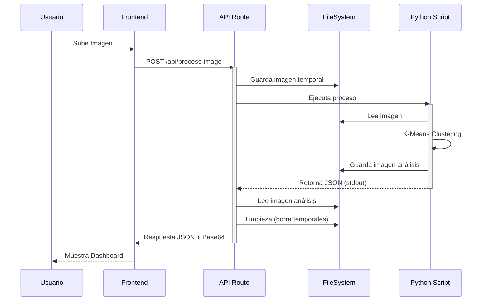

# Arquitectura del Sistema

## Diagrama de Flujo de Datos

### Diagrama de Componentes (Estructura)

### Diagrama de Secuencia (Flujo de Datos)

## Componentes Principales

### 1. Cliente (Browser)
-   **Responsabilidad:** Interfaz de usuario y experiencia interactiva.
-   **Tecnología:** React (Next.js) + Leaflet.
-   **Flujo:** El usuario selecciona una ubicación y sube una imagen. El cliente valida el tipo de archivo antes de enviarlo para reducir carga en el servidor.
-   **Visualización:** Utiliza `react-leaflet` para superponer capas de información geográfica y mostrar los resultados del análisis en tiempo real.

### 2. Servidor API (Next.js)
-   **Responsabilidad:** Orquestación, validación y seguridad.
-   **Tecnología:** Node.js (API Routes).
-   **Funciones Críticas:**
    -   **Gateway:** Recibe peticiones `POST` y valida headers y body.
    -   **Gestión de Archivos:** Escribe streams de entrada en disco (`temp/`) de manera segura.
    -   **Bridge Node-Python:** Invoca el subproceso de Python usando `execFile` (seguro) y captura `stdout`/`stderr`.
    -   **Limpieza:** Garantiza que no queden residuos en el disco tras la respuesta.

### 3. Motor de Procesamiento (Python)
-   **Responsabilidad:** Cómputo intensivo y algoritmos de visión.
-   **Tecnología:** Python 3 + OpenCV + Scikit-Learn.
-   **Lógica:**
    -   **Preprocesamiento:** Normalización y conversión de espacio de color (BGR -> RGB).
    -   **K-Means:** Agrupamiento de píxeles basado en similitud cromática para segmentar coberturas.
    -   **Generación de Assets:** Crea imágenes de análisis y gráficos estadísticos con Matplotlib.
    -   **Salida Estructurada:** Emite un JSON puro por salida estándar para ser consumido por la API.

## ⚠️ Análisis de Trade-offs y Deuda Técnica

### 1. Acoplamiento Fuerte (Node-Python)
-   **Problema:** La API depende de que el script de Python imprima un JSON válido en `stdout`.
-   **Impacto:** Cambios en los `print` de depuración en Python pueden romper la API.
-   **Mitigación Actual:** Se usa un delimitador estricto (`JSON_RESULTS:`) y bloques `try-catch` específicos para el parseo.

### 2. Escalabilidad Vertical vs Horizontal
-   **Estado Actual:** Cada petición levanta un proceso de Python independiente (overhead de ~200ms por arranque).
-   **Limitación:** No escala bien bajo alta concurrencia (CPU bound).
-   **Solución Futura:** Implementar una cola de tareas (BullMQ) y workers persistentes o migrar a un microservicio FastAPI.

### 3. Estado Efímero
-   **Diseño:** "Fire and forget". No hay base de datos.
-   **Ventaja:** Privacidad total (los datos se borran) y bajo costo de almacenamiento.
-   **Desventaja:** Imposibilidad de consultar históricos.
